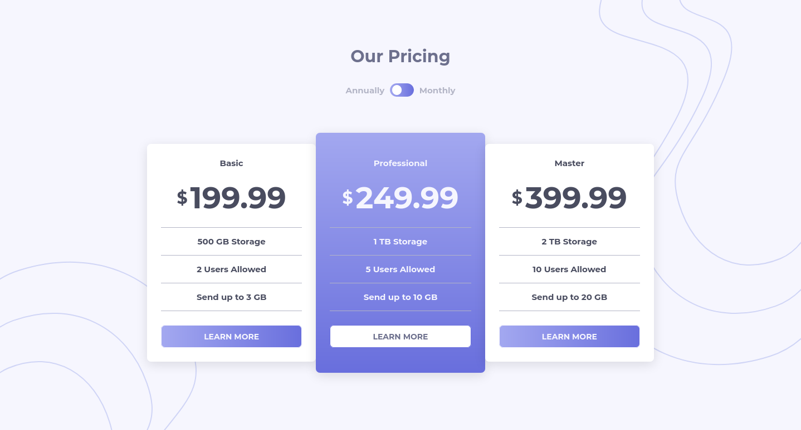

# Frontend Mentor - Pricing component with toggle solution

This is a solution to the [Pricing component with toggle challenge on Frontend Mentor](https://www.frontendmentor.io/challenges/pricing-component-with-toggle-8vPwRMIC). Frontend Mentor challenges help you improve your coding skills by building realistic projects.

### The challenge

Users should be able to:

-   View the optimal layout for the component depending on their device's screen size
-   Control the toggle with both their mouse/trackpad and their keyboard
-   **Bonus**: Complete the challenge with just HTML and CSS

### Screenshot



### Links

-   Solution URL: [Add solution URL here](https://your-solution-url.com)
-   Live Site URL: [Add live site URL here](https://your-live-site-url.com)

## My process

### Built with

-   Semantic HTML5 markup
-   Flexbox
-   Mobile-first workflow

### What I learned

-   I was having a problem with the css animations not resetting properly but I found a fix on stackoverflow that uses scrollBy(0,0).

```js
for (let i = 0; i < PRICES.length; i++) {
    PRICES_WRAP[i].classList.remove("active");
    PRICES_WRAP[i].scrollBy(0, 0);
    PRICES_WRAP[i].classList.add("active");
}
```

### Useful resources

-   [How to make animations trigger again after toggling a class](https://stackoverflow.com/questions/16050914/css-animation-doesnt-restart-when-resetting-class) - this helped me get the animations for the price to work.
